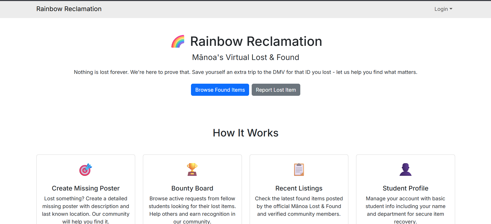
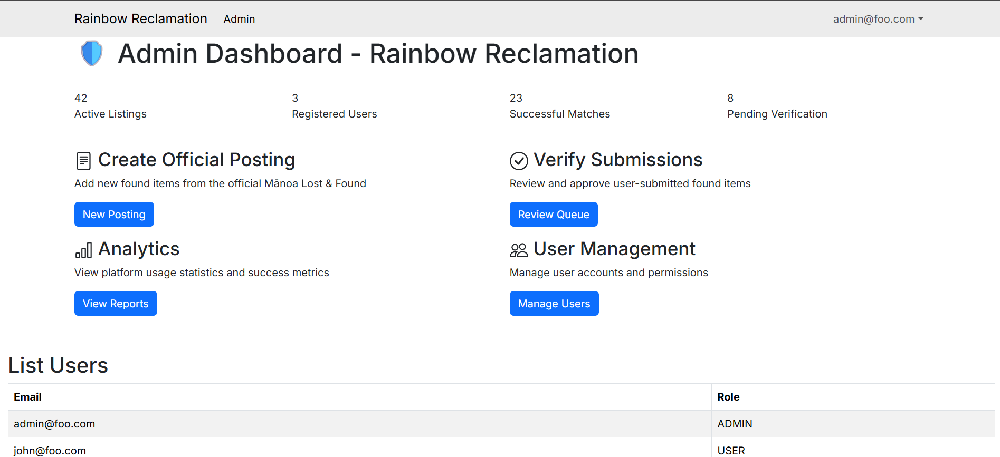
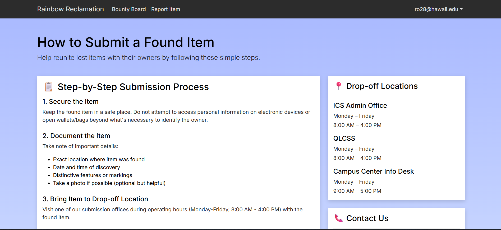
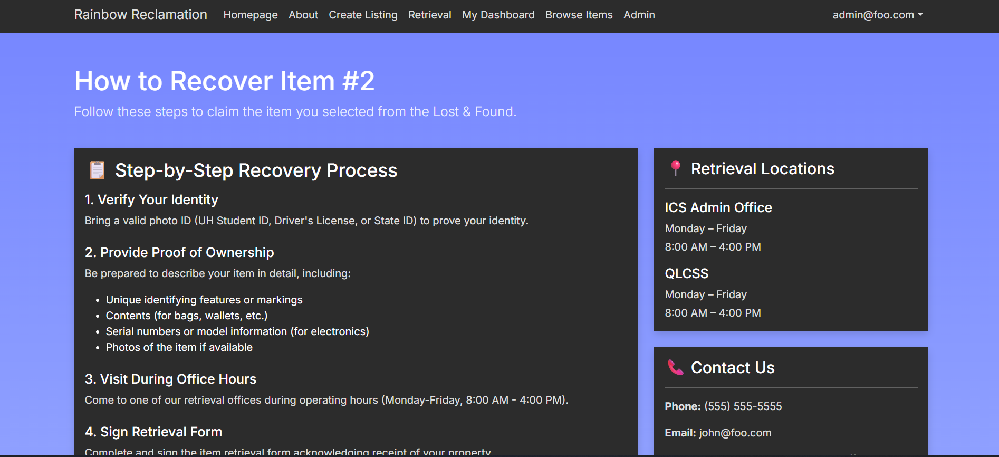
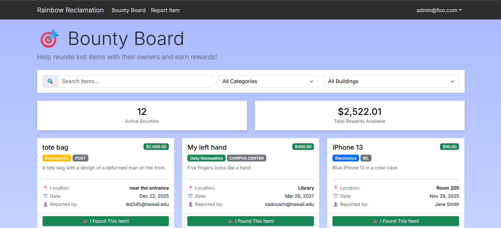

## Rainbow Reclamation

**UH Mānoa Digital Hub for Reporting and Recovering Lost Items**

### Overview

Rainbow Reclamation is a web application designed to serve as a centralized, digital lost-and-found system for the University of Hawaiʻi at Mānoa community. The platform addresses a common campus issue: lost personal items such as IDs, wallets, and electronics that are often scattered across offices or never properly reported.

The application allows students, faculty, and staff to report lost or found items, browse listings, and follow clear recovery instructions without unnecessary in-person visits. By combining item reporting, dashboards, and a bounty board, Rainbow Reclamation streamlines the recovery process and improves transparency across the campus community.

---

### Contributions

My contributions focused primarily on user experience, layout consistency, and key functional pages that made the application feel cohesive and usable.

I created mockup pages for the **landing page**, **user dashboard**, and **admin dashboard**, establishing a consistent visual structure and navigation flow across the application. These pages help users quickly understand the purpose of the platform and how to interact with its core features.

#### Page Mockups

##### Landing Page

##### User Dashboard

##### Admin Dashboard

I was also responsible for the **global styling (`global.css`)**, which unified typography, spacing, colors, and layout across all pages. This reduced visual fragmentation caused by parallel development and helped present the app as a polished product.

##### Submission Instructions Page

##### Claim (Recovery) Instructions Page

I also worked on the **bounty board feature**, which allows users to associate rewards with lost items. This feature increases engagement and incentivizes the return of lost property, making the platform more practical and impactful.

##### Bounty Board

---

### What I Learned

This project reinforced the importance of early design alignment and structure in team-based software development. Establishing shared layouts and styling conventions early reduced integration friction and prevented the interface from becoming inconsistent.

I also learned that front-end development is closely tied to usability and trust. Pages that guide users through real-world actions—such as submitting or reclaiming lost items—must be clear, predictable, and well-structured to feel reliable.

From a collaboration perspective, the project emphasized accountability and communication. Coordinating design decisions alongside active feature development helped ensure that the user interface supported actual functionality rather than existing only as isolated mockups.

---

### Links

- **Project Repository:** https://github.com/manoa-warrior-collective/rainbow-reclamation
- **Organization Page:** https://github.com/manoa-warrior-collective
- **Live Deployment:** https://rainbow-reclamation.vercel.app
