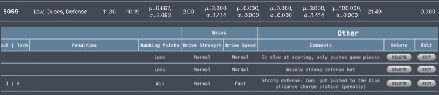

This project was done by a group during our junior and senior year of highschool. The goal of the scouting app was to collect data of other robots in the competition of to figure out how each robot would score in the game, strategy the team use with the robot, and how consistent the robot would score during the game. When users input the data they collect from the game, the app would calculate the average and mean of the robot. Which it would be uploaded to a table on the app to display the mean data of robot for the whole competition. When searching up the team on the app it would display their all of their from each match data and can be reorganized into a different table to get their mean and average of the compeition. This project was done through using Javascript and HTML coding on VsCode. Which include the app design, colors, back and front end of the app, and collecting data for calculating mean and average.

When I was working with the group getting the scouting app to work, we were split into two pairs. One pair was doing the front end of the program that contains the store data of the calculation being put onto a table. While I and another club memeber were doing the back end of the program that does all the calculations for the app and sends all the data it has collected into the graph. Our mentor who was helping developing this code would help us review our code and help us with connecting a website API to our code to help get a match list in to the app. When I was doing the back end of the code we would run some issues about connecting the API to code to help score certain data to the front end of the app, but we manage to understand how to go around the loop by fixing the key name of API to have access to it.

From what I learn from this experince, I would often find myself getting to talk with the front end group a lot due to asking questions of what data are they storing on the table and what do they want us to add at the back end to have access in the app. Additionally, I found that merging code in Github with the help of VsCode really help with solving issues since it highlights what overlapped with each other in the merge that conflicted with each other. Also, I learn the communication with your partner is essential since we are working on the some code, but working on differnt aspects of it and you don't want to merge when working on the same class file for the code since you might have get the solution in a different way and later have to fix the merging conflict afterwards to choose which solution of code is better. Unfornately, I don't have the GitHub repository anymore since it was linked to my high school email address, but we did have a layout of how to the app should look like for the most part on Google Docs

Here is the scouting app layout: <https://docs.google.com/document/d/109sv5VNpk75GmAcP5Ofg75TwocZvwWZzOEhjGlqqbcM/edit?usp=sharing>
