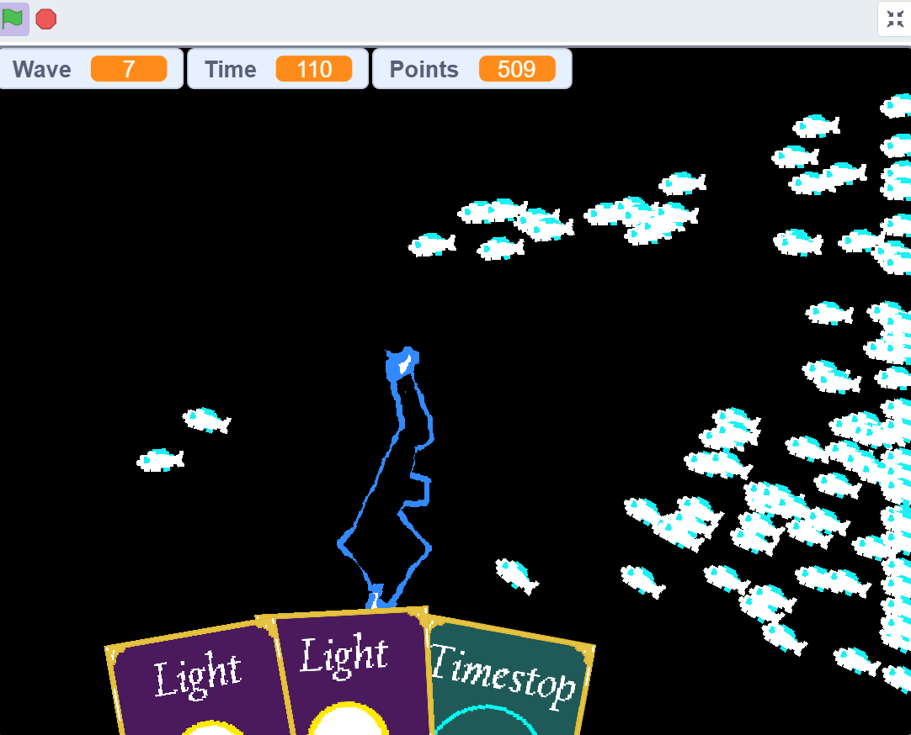
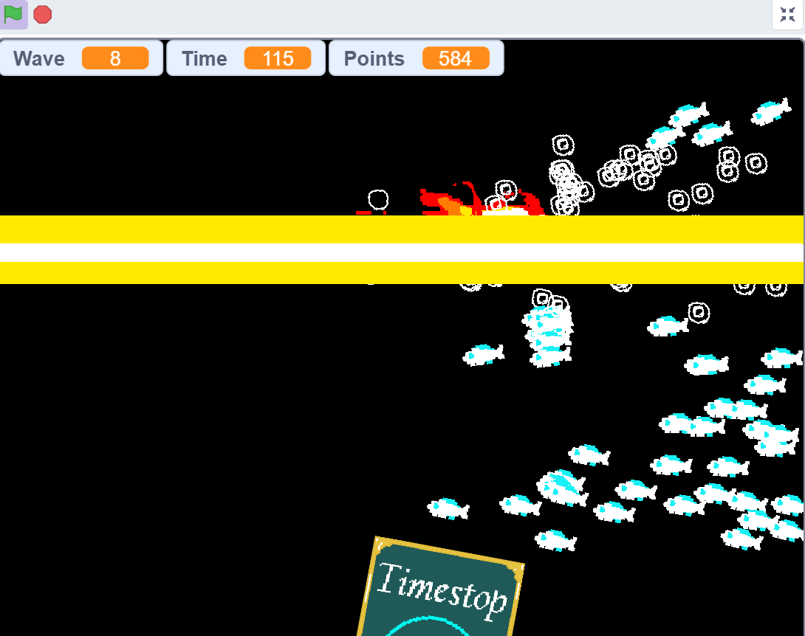
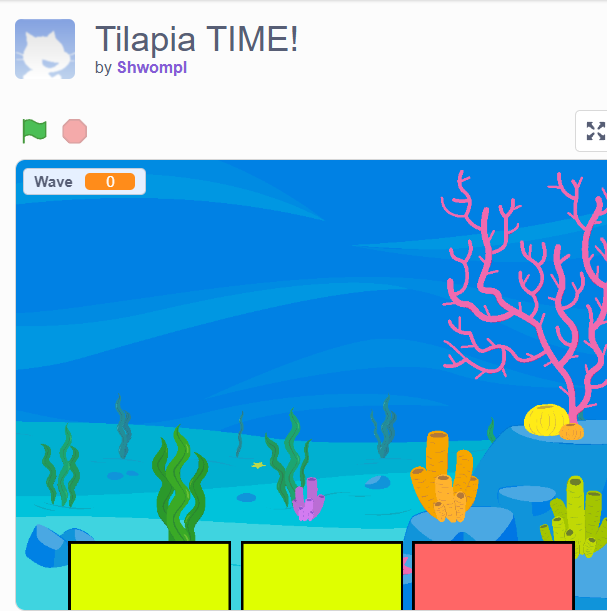
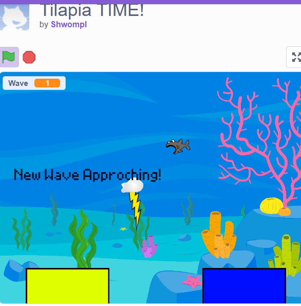

  
  
  
  

Here is the game link to Tilapia TIME! (REAWAKEN): <https://scratch.mit.edu/projects/1112525545/>

Here is the game link to Tilapia TIME!: <https://scratch.mit.edu/projects/1111655525>
